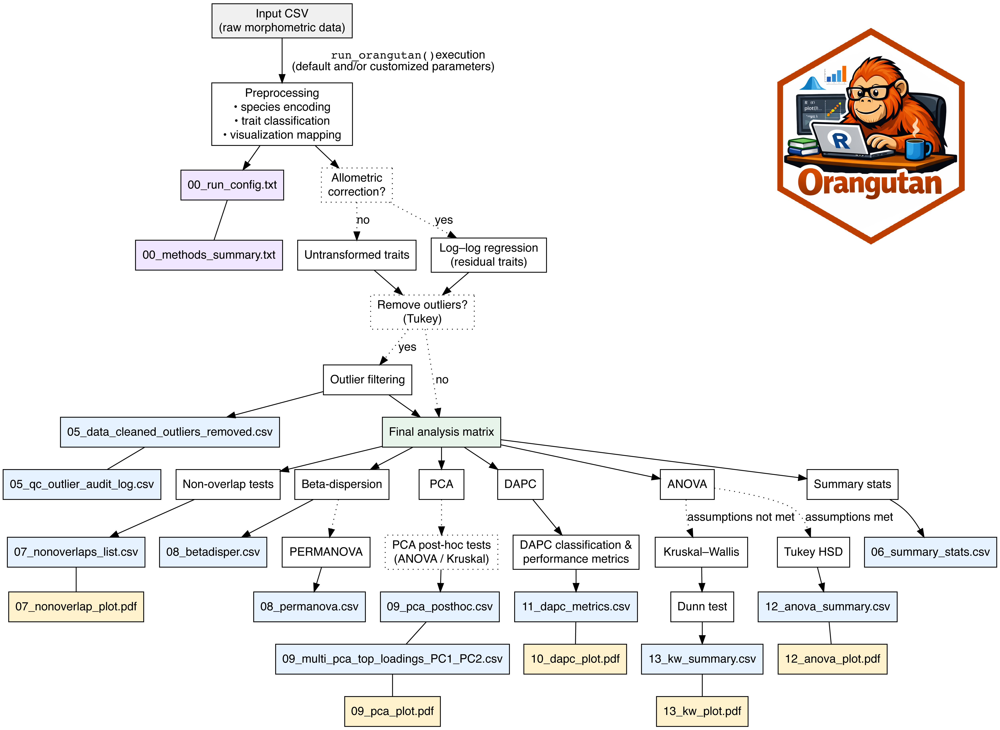

# Orangutan

[](https://doi.org/10.5281/zenodo.18488056) [](https://cran.r-project.org/package=Orangutan) [](https://cran.r-project.org/package=Orangutan) [](https://cran.r-project.org/package=Orangutan) [](https://metalofis.r-universe.dev/Orangutan)


Orangutan is an R package for analyzing and visualizing measurements (morphometrics) from groups such as species or populations. It runs a full analysis pipeline that summarizes data, finds variables that differentiate groups, performs multivariate and univariate statistics, and produces publication-ready plots.

## Table of Contents
- [What Orangutan does](#what-orangutan-does)
- [Installation](#installation)
- [Implementation](#Implementation)
- [Description of run_orangutan() arguments](#description-of-run_orangutan-arguments)
- [Input data format](#input-data-format)
- [Citation](#citation)
- [Contributing / Support](#contributing--support)


## What Orangutan does

- **Loads and validates your CSV data** (requires a `species` column).

- **Optionally applies allometric correction**  
  Adjusts mensural measurements for a user-selected variable (e.g. body size).
    - Included in downstream cleaned datasets and summaries (no standalone file)

- **Optionally removes extreme outliers within species**  
  Uses user-specified variables and a configurable tail percentage.
    - `05_data_cleaned_outliers_removed.csv`
    - `05_qc_outlier_audit_log.csv`

- **Computes per-species summary statistics**  
  Mean, SD, min, and max for all variables.
    - `06_summary_stats.csv`

- **Identifies variables that do not overlap between species**  
  Finds diagnostic traits and produces publication-ready plots.
    - `07_nonoverlaps_list.csv`
    - `07_nonoverlap_plot_<species1>_vs_<species2>_<variable>.pdf`

- **Runs multivariate tests on the full dataset**
  - Tests homogeneity of multivariate dispersion (beta-dispersion).
  - Runs PERMANOVA and flags results if dispersion assumptions are violated.
    - `08_multi_betadisper_overall_test.csv`
    - `08_multi_betadisper_pairwise_tests.csv`
    - `08_multi_permanova_species_effect.csv`

- **Performs Principal Components Analysis (PCA)** on scaled variables
  - Produces a PCA scatterplot with optional group encirclement.
  - Reports variable loadings contributing to PC1 and PC2.
    - `09_multi_pca_plot.pdf`
    - `09_multi_pca_top_loadings_PC1_PC2.csv`

- **Runs PCA axis post-hoc tests**
  - Tests PCA axes cumulatively explaining ~90% of variance.
  - Uses ANOVA + Tukey HSD when assumptions are met.
  - Falls back to Kruskal–Wallis + Dunn tests otherwise.
  - Reports significant species differences per PC axis.
    - `09_multi_pca_posthoc.csv`

- **Runs Discriminant Analysis of Principal Components (DAPC)**
  - Produces discriminant plots.
  - Evaluates classification performance.
  - Reports misclassified individuals.
    - `10_multi_dapc_plot.pdf`
    - `11_multi_dapc_confusion_matrix.csv`
    - `11_multi_dapc_performance_metrics.csv`
    - `11_multi_dapc_misclassified_individuals.csv`

- **Performs univariate tests for each variable**
  - ANOVA + Tukey when parametric assumptions are met.
  - Kruskal–Wallis + Dunn when parametric assumptions fail.
  - Generates corresponding plots with significance lettering.
    - `12_uni_anova_summary.csv`
    - `12_uni_anova_plot_<variable>.pdf`
    - `13_uni_kruskalwallis_summary.csv`
    - `13_uni_kruskalwallis_plot_<variable>.pdf`

- **Ensures reproducibility**
  - Saves all results, plots, configuration details, and methods summaries to `output_dir`.
    - `00_run_config.txt` — exact function call, timestamp, environment
    - `00_methods_summary.txt` — human-readable methods summary





## Installation

### Stable version (CRAN)

Install the latest stable release from CRAN:

```r
install.packages("Orangutan")
```

### Development version (GitHub)

Install the development version from GitHub (requires `devtools`):

```r
install.packages("devtools")
devtools::install_github("metalofis/Orangutan-R")
```

## Implementation

Quick example: `run_orangutan` called with default parameters (writes results next to the input file by default):

```r
library(Orangutan)

run_orangutan("data/my_dataset.csv")
```

Full example: `run_orangutan` called with all available arguments

```r
library(Orangutan)  # Load the Orangutan package

run_orangutan(
  # ---------- Input / output ----------
  data_path = "data/my_dataset.csv",             # Path to your input CSV dataset
  output_dir = "address/to/orangutan_outputs",   # Folder where all outputs (plots, tables) will be saved
  
  # ---------- Allometry ----------
  apply_allometry = TRUE,             # Whether to adjust measurements for allometry
  allometry_var = "SVL",              # Column used as the reference variable for allometry correction
  
  # ---------- Outlier handling ----------
  remove_outliers = TRUE,             # Whether to remove extreme values (outliers)
  outlier_vars = c("SVL"),            # Which variables to check for outliers
  outlier_tail_pct = 0.05,            # Proportion of extreme values to remove from each tail (5% here)
  
  # ---------- PCA / DAPC highlighting ----------
  species_to_encircle = c("carolinensis", "torresfundorai"), # Species to highlight on PCA/DAPC plots
  
  # ---------- Color palette ----------
  palette_name = "Paired",            # Name of the color palette for plots ("Paired", "Set3", "Dark2")
  
  # ---------- Point aesthetics ----------
  point_aes = list(
    point_size    = 3.5,              # Size of each individual point
    jitter_width  = 0.1,              # Horizontal jitter to prevent overplotting
    jitter_alpha  = 0.8,              # Transparency of points
    jitter_shape  = 21,               # Shape of the points (21 = filled circle with border)
    jitter_color  = "black",          # Border color of points
    jitter_stroke = 0.35              # Thickness of the point border
  ),
  
  # ---------- Mean point aesthetics ----------
  mean_aes = list(
    size   = 1.8,                      # Size of the mean point
    shape  = 21,                       # Shape of the mean point
    fill   = "white",                  # Fill color of the mean point
    color  = "black",                  # Border color of the mean point
    stroke = 0.6                       # Thickness of the mean point border
  ),
  
  # ---------- Violin aesthetics ----------
  violin_aes = list(
    alpha = 0.4                         # Transparency of violin plots
  ),
  
  # ---------- Boxplot aesthetics ----------
  box_aes = list(
    alpha = 0.4,                        # Transparency of boxplots
    width = 0.15                        # Width of boxplots
  ),
  
  # ---------- Label / text control ----------
  label_aes = list(
    text_size      = 6,                 # Size of text labels on plots
    axis_text_size = 10,                # Size of axis tick labels
    title_size     = 12,                # Size of plot titles
    label_offset   = 0.05               # Distance of labels from points
  ),
  
  # ---------- Optional label templates ----------
  label_templates = list(
    nonoverlap_title = "Non-Overlapping Pair: %s vs %s for %s", # Title template for non-overlapping variable plots
    pca_x = "PC1 (%s%% variance)",       # Label for PCA X-axis with explained variance
    pca_y = "PC2 (%s%% variance)",       # Label for PCA Y-axis with explained variance
    dapc_x = "LD1 (%s%%)",               # Label for DAPC X-axis with explained variance
    dapc_y = "LD2 (%s%%)",               # Label for DAPC Y-axis with explained variance
    dapc_title_1d = "DAPC – Single Discriminant Axis" # Title for one-dimensional DAPC plots
  ),
  
  # ---------- Multivariate test seeds ----------
  seeds = list(betadisper = 123, permanova = 456),   # Seed for reproducible dispersion/randomization calculations and permutation tests
  
  # ---------- Messaging ----------
  verbose = FALSE                                    # Whether to print progress messages in console
)
```

## Description of run_orangutan() arguments

- data_path: Path to your CSV file (**required**).
- output_dir: Where results are saved (default: folder next to the input file).
- apply_allometry: TRUE/FALSE — adjust measurements by a size variable.
- allometry_var: Variable used as the size reference for allometric correction (**required** if `apply_allometry = TRUE`).
- remove_outliers: TRUE/FALSE — whether to remove outliers by species.
- outlier_vars: Variable(s) used to detect outliers (**required** if remove_outliers = TRUE).
- outlier_tail_pct: How extreme to consider for outliers (default 0.05 = 5% tail).
- species_to_encircle: Species names to highlight (draw polygons) in PCA/DAPC plots.
- palette_name: RColorBrewer palette to use for colors (default "Paired").
- seeds: Named list of seeds for reproducible random steps (default: `list(betadisper = 123, permanova = 456)`).
- label_templates: Optional list to tweak plot labels and titles (sprintf-style templates).
- point_aes, mean_aes, violin_aes, box_aes, label_aes: Lists to customize plot appearance (see Plot customization below).


## Input data format

- A CSV with a `species` column and one or more numeric measurement columns.
  
| species        | main_length | Head_length | Supralabials |
|---------------|-------------|-------------|--------------|
| allisoni      | 86.5        | 25.2        | 9            |
| allisoni      | 73.6        | 24.8        | 8            |
| carolinensis  | 63.0        | 18.3        | 8            |
| carolinensis  | 59.0        | 19.17       | 8            |
| torresfundorai| 66.9        | 18.7        | 7            |
| torresfundorai| 70.9        | 23.6        | 7            |


## Citation

Torres, J. (2026). Orangutan: An R Package for Analyzing and Visualizing Phenotypic Data in the Context of Species Descriptions and Population Comparisons. Ecology and Evolution, 16(2), e73111. https://doi.org/10.1002/ece3.73111

## Contributing / Support

- Open issues or pull requests on the project GitHub for bugs, feature requests, or improvements.
- Add a star if this package was useful.
